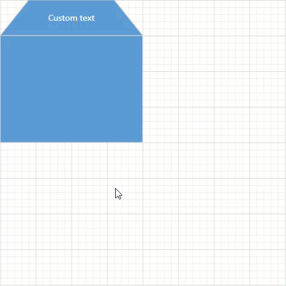

<!-- default badges list -->

[](https://supportcenter.devexpress.com/ticket/details/T1174669)
[](https://docs.devexpress.com/GeneralInformation/403183)
<!-- default badges end -->

# WinForms DiagramControl - Proportionally Resize Shapes Within the Parent Container

This example demonstrates how to resize inner shapes when their parent container is resized. You can implement this additional logic if you [create custom shapes based on containers](https://github.com/DevExpress-Examples/winforms-diagram-create-custom-shapes-based-on-diagram-containers) or use containers to group shapes.



## Implementation Details

1. Create a [DiagramContainer](https://docs.devexpress.com/WindowsForms/DevExpress.XtraDiagram.DiagramContainer) class descendant to retain the behavior of standard containers:

   ```cs
   public class CustomDiagramContainer : DiagramContainer { }
   ```

2. Handle the [DiagramControl.BeforeItemsResizing](https://docs.devexpress.com/WindowsForms/DevExpress.XtraDiagram.DiagramControl.BeforeItemsResizing) event and pass container child items to the `e.Items` collection:

   ```cs
   private void DiagramControl1_BeforeItemsResizing(object sender, DiagramBeforeItemsResizingEventArgs e) {
       var containers = e.Items.OfType<CustomDiagramContainer>();
       foreach (var customContainer in containers) {
           e.Items.Remove(customContainer);
           foreach (var item in customContainer.Items)
               e.Items.Add(item);
       }
   }
   ```

   In this case, the `DiagramControl` resizes these inner items instead of the parent container.

3. Handle the [DiagramControl.ItemsResizing](https://docs.devexpress.com/WindowsForms/DevExpress.XtraDiagram.DiagramControl.ItemsResizing) event and correct the container position and size:

   ```cs
   private void DiagramControl1_ItemsResizing(object sender, DiagramItemsResizingEventArgs e) {
       var groups = e.Items.GroupBy(x => x.Item.ParentItem);
       foreach (var group in groups) {
           if (group.Key is CustomDiagramContainer) {
               var customContainer = (CustomDiagramContainer)group.Key;
               var containingRect = customContainer.Items.Select(x => x.RotatedDiagramBounds().BoundedRect()).Aggregate(Rect.Empty, Rect.Union);
               customContainer.Position = new PointFloat((float)containingRect.X, (float)containingRect.Y);
               customContainer.Width = (float)containingRect.Width;
               customContainer.Height = (float)containingRect.Height;
           }
       }
   }
   ```

## Files to Review

- [Form1.cs](./CS/WindowsFormsApp4/Form1.cs) (VB: [Form1.vb](./VB/WindowsFormsApp4/Form1.vb))

## Documentation

- [Containers and Lists](https://docs.devexpress.com/WindowsForms/117672/controls-and-libraries/diagrams/diagram-items/containers)
- [DiagramControl.BeforeItemsResizing](https://docs.devexpress.com/WindowsForms/DevExpress.XtraDiagram.DiagramControl.BeforeItemsResizing)
- [DiagramControl.ItemsResizing](https://docs.devexpress.com/WindowsForms/DevExpress.XtraDiagram.DiagramControl.ItemsResizing)

## More Examples

- [WinForms DiagramControl - Create Custom Shapes Based on Diagram Containers](https://github.com/DevExpress-Examples/winforms-diagram-create-custom-shapes-based-on-diagram-containers)
- [WinForms DiagramControl - Create Rotatable Containers with Shapes](https://github.com/DevExpress-Examples/winforms-diagram-create-rotatable-containers-with-shapes)
